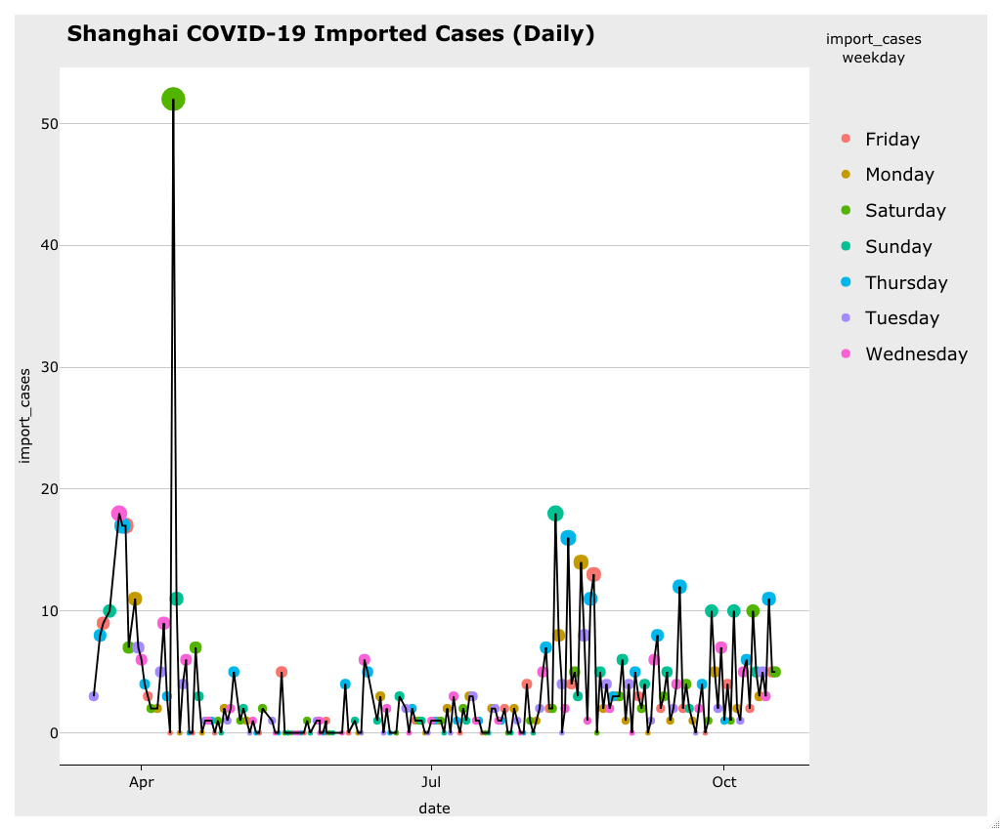
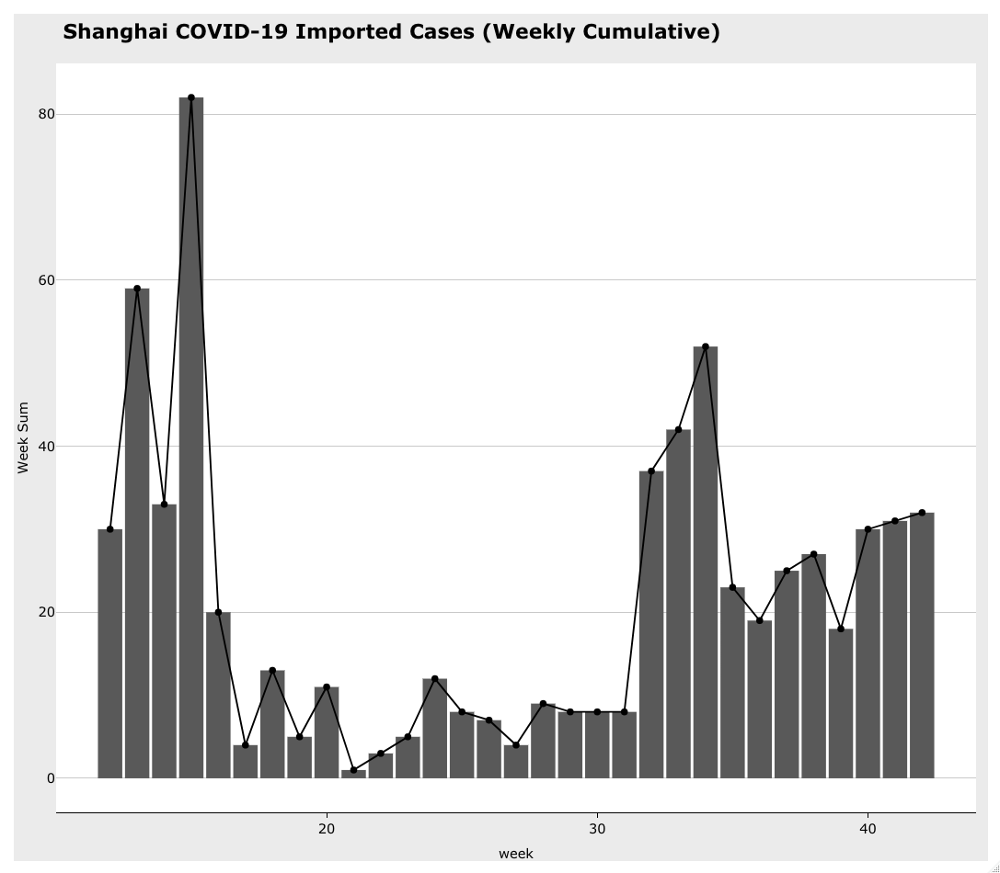
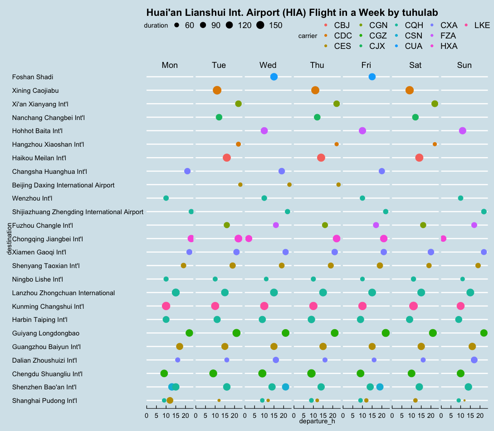

# DATAChina
 data analysis for my beloved China

## COVID-Shanghai

我爬取了上海卫健委的新冠病例每日通报，经过对境外输入病例的数据分析发现：

从3月17日到10月17日（除去4月11日），上海平均每天输入“新冠”3.01例。输入病例数与星期密切相关，其中周四最高，日均输入4.42例，周二最低，日均输入2.13例。

两个关键时间节点（4月11日和8月8日）对输入压力有显著影响，4月11日单日输入52例后，病例数迅速下降，并长期维持在周增15例以下。在经过长期低输入后，从第32周开始，上海恢复至单日最高新增10例以上，周增30-50例。

综合以上分析，我判断影响上海“新冠”输入病例数最主要的因素是政策因素，即通过调节国际航班接待数来调控输入压力。并且我预测，“最高单日日增10例，周增20例”应该是政策下一步调节的关键节点。这个数字可能是决策者的心理界限（即输入数不应高于第16周），也有可能与上海入境检疫与医疗能力有关。

在入境政策做出重大变化之前，我建议上海的决策者可以在可影响范围内对航班入境星期做优化，均衡输入压力；我建议航空公司的新航线选择低压力口岸入境（如吉祥航空HO1665/6，郑州-赫尔辛基）。

数据来源：上海市卫健委疫情通报(http://wsjkw.sh.gov.cn/yqtb/index.html)

## Huai'an Lianshui International Airport (HIA) - Destinations Derved

